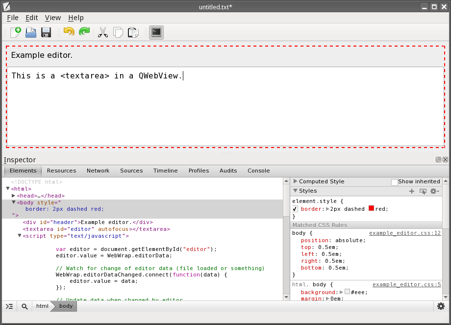

Web Wrap Editor
===============

Universal editor wrapper, which wraps HTML5-based editor with a desktop window.

Architecture
------------

Web Wrap Editor is a very simple editor based on
[QMainWindow Application Example](http://doc.qt.io/qt-5/qtwidgets-mainwindows-application-example.html),
where the [QPlainTextEdit](http://doc.qt.io/qt-5/qplaintextedit.html) widget is
replaced with [QWebView](http://doc.qt.io/qt-5/qwebview.html). To connect Qt
user interface with content of the QWebView a proxy object `WebWrap` is
injected into global namespace of a page displayed in the QWebView. The page
contains a textarea and a little bit of glue (JavaScript) to connect
a HTML5-based editor with the Qt user interface.

Web Wrap Editor loads JSON file, detects what kind of data it contains and
initializes appropriate editor by loadin a glue HTML page. Edited data are
loaded into a buffer in the `WebWrap` object and after they are modified by the
HTML5-based editor they may be saved back to the JSON file.

To make debugging easier, a web inspector is available (just like in any other
Webkit browser) and it is also possible to display the buffer containing the
edited data.

The glue HTML page may insert custom actions into a Tools menu and toolbar.
Common actions in Edit and Help menus are handled by the glue, but these cannot
be modified (yet). Actions from File and View menus are not available in the
HTML glue at all.

Features
--------

  - Load & save a local JSON file.
  - Detect type of data in the JSON file and load appropriate editor.
  - Edit actions (copy & paste, undo & redo).
  - Customizable Tools menu (defined by editor/glue).
  - Simple editor-specific help screen.
  - Editor (HTML page) can be reloaded without loosing edited data.
  - Debugging: Web inspector, file buffer view.

References
----------

  - [Qt Documentation: Making Applications Scriptable](http://doc.qt.io/qt-4.8/scripting.html)

